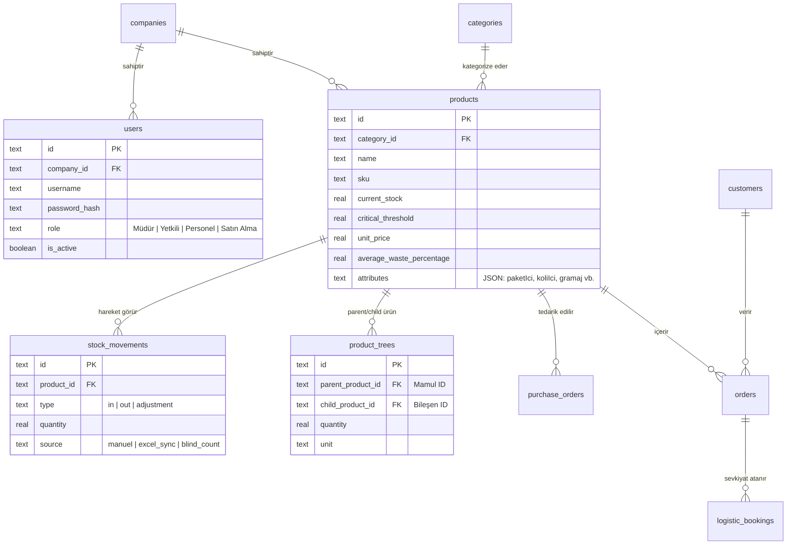
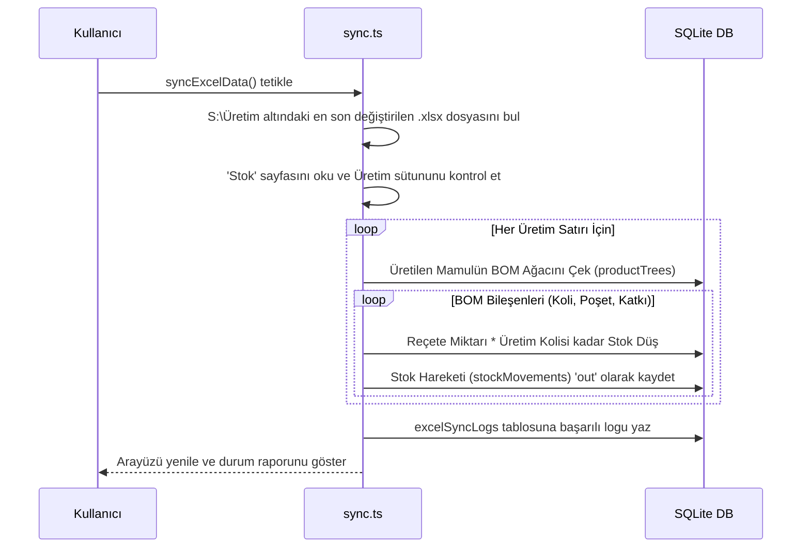

# MutlukalERP Geliştirici Kılavuzu (developer.md)

Bu el kitabı, MutlukalERP projesinin mimarisini, dosya yapısını, veritabanı şemasını, iş süreçlerini ve entegrasyon modellerini detaylı bir şekilde açıklamaktadır. Projeyi devralan yeni geliştiriciler için eksiksiz bir rehber niteliğindedir.

---

## 1. Genel Mimari ve Teknoloji Yığını

MutlukalERP, hibrit bir kurumsal mimariye sahiptir. Tüm kritik iş mantığı fabrikada yerel olarak çalışırken, canlıya tünellenen hafif bir veri katmanı ile dış dünya ile entegre olur.

* **Framework:** Next.js 16 (App Router, Turbopack, Server Actions)
* **Veritabanı ve ORM:** SQLite (`better-sqlite3` yerel motoru) & Drizzle ORM
* **Veri Senkronizasyonu:** Vercel Blob Storage (Canlı stok verilerinin güvenli tünellenmesi)
* **E-Posta Servisi:** Nodemailer (SMTP entegrasyonu)
* **Excel Çözümleyici:** XLSX (SheetJS)

---

## 2. Sistem Mimarisi Şeması

Aşağıdaki şemada yerel fabrika sunucusu ile buluttaki Vercel uygulamasının hibrit çalışma modeli gösterilmektedir:

```mermaid
graph TD
    subgraph Fabrika Yerel Ağı (Yerel Sunucu)
        DB[(mutlukal.db SQLite)] <--> ERP[Next.js Yerel ERP Sunucusu]
        ExcelFolder[S:/İş Emirleri *.xlsx] -->|Sync Excel| ERP
        ERP -->|Dinamik BOM Stok Düşümü| DB
        Cron[Yerel Cron Servisi] -->|Her 10 dk| SyncScript[sync_stocks_to_vercel.js]
        SyncScript -->|Yerel SQL Çek| DB
    end

    subgraph Bulut Ortamı (Vercel)
        SyncScript -->|Şifreli API İsteği| VercelAPI[Next.js API: /api/sync-stocks]
        VercelAPI -->|Dosya Güncelle| Blob[(Vercel Blob: stocks.json)]
        Blob <--> PublicApp[Canlı ERP Portalı]
    end

    subgraph Dış Dünya (Kullanıcılar)
        SalesAgent[Satış Temsilcileri] <-->|Stok Kontrolü| PublicApp
        ClientBrowser[Lokal Yetkili ve Personel] <-->|Yerel Ağ Girişi| ERP
    end
```

---

## 3. Veritabanı İlişkileri Şeması (ERD)

Projenin veritabanı şeması (`src/db/schema.ts`) altındaki ilişkisel yapı şu şekildedir:



---

## 4. Dizin ve Dosya Yapısı Açıklamaları

Aşağıdaki tabloda projedeki dizinlerin ve önemli dosyaların görevleri açıklanmıştır:

| Dizin / Dosya | Amaç ve Açıklama |
| :--- | :--- |
| `src/actions/` | Projede kullanılan tüm Next.js Server Action fonksiyonları burada yer alır. |
| `├── erp-actions.ts` | Departmanların (Pazarlama, Planlama, Satın Alma, Lojistik) temel CRUD işlemlerini barındırır. |
| `├── is-emirleri.ts` | Excel okuma, 7 günlük gelecek iş emirlerini çıkarma ve stok eksiklerini hesaplama motoru. |
| `├── sync.ts` | Yerel Excel planları okunduğunda BOM ağaçlarını dolaşarak stoktan düşüm yapan arka plan servisi. |
| `src/app/` | Next.js App Router sayfaları. |
| `├── api/sync-stocks/` | Yerel stokları Vercel Blob'a yükleyen API endpoint'i. |
| `├── dashboard/` | Departman sayfaları (Pazarlama, Planlama, Satın Alma, Lojistik, Mail Ayarı, Kullanıcılar). |
| `src/components/` | Arayüz bileşenleri (Pazarlama, Planlama, Satın Alma, Lojistik vb. için Client-side UI kodları). |
| `src/db/` | Drizzle ORM veritabanı bağlantı ve şema tanımları (`schema.ts`, `index.ts`). |
| `src/lib/services/` | Hesaplama ve e-posta bildirim motorları (`CostCalculator.ts`, `NotificationService.ts`). |
| `sync_stocks_to_vercel.js`| Yerel sunucudan Vercel Blob'a sadece stok miktarlarını tünelleyen bağımsız Node.js scripti. |
| `migrate.js` | Drizzle şemasındaki değişiklikleri yerel SQLite veritabanına uygulayan migration aracı. |
| `seed.js` / `seed_bom.js` | Projeyi sıfırdan kurarken ilk verileri ve BOM ağaçlarını Excel'den okuyup veritabanına yazan tohumlama araçları. |

---

## 5. Kritik İş Mantığı Akışları

### A. Üretim Planı Senkronizasyonu ve Stok Düşüm Algoritması
Fabrikada `Senkronize Et` tıklandığında veya cron çalıştığında sırasıyla şu işlemler gerçekleşir:



### B. Gelecek 7 İş Emri Stok Eksik Kontrolü (`is-emirleri.ts`)
Sıradaki işlerin başlayıp başlayamayacağını belirlemek için kullanılan mantık:
1. `is-emirleri.ts` dosyası, en son güncellenen iş emri Excel dosyasını (`MUTLUKAL_IS_EMRI_01062026.xlsx` vb.) okur.
2. Sıradaki her bir makine için planlanmış gelecek ilk 7 iş emrini analiz eder.
3. Her iş emrindeki mamulün BOM reçetesi çözümlenir:
   * Gerekli Koli, Poşet ve Katkı miktarı = `Planlanan Adet * Reçete Oranı`.
4. Gereksinim miktarı yerel depodaki `current_stock` ile karşılaştırılır.
5. Eksik malzeme varsa iş emri **Stok Yetersiz** durumuna çekilir ve eksik kalemler listelenir.
6. `Eksikleri E-Posta ile Bildir` tıklandığında Satın Alma, Üretim Müdürü ve Müdür e-posta adreslerine anlık olarak eksik listesi gönderilir.

---

## 6. Geliştiriciler İçin Önemli Notlar

### SQLite Dosya Kilidi ve Eşzamanlılık
Next.js Server Action'lar yerel `better-sqlite3` kullandığı için veritabanına aynı anda birden fazla yazma isteği geldiğinde dosya kilidi (`database is locked`) oluşabilir. Bu durumu önlemek amacıyla yazma işlemleri olabildiğince optimize edilmiş ve Drizzle `transaction` blokları içinde toplanmıştır.

### Vercel Blob ve Cache Yönetimi
Canlıda (`process.env.VERCEL` aktifken) Next.js uygulaması yerel SQLite yerine Vercel Blob'tan veri okuduğu için, tarayıcının veya Next.js'in veri getirme (fetch) isteklerini önbelleğe almaması kritik önem taşır. Bu yüzden `StockPageServer.tsx` içindeki fetch istekleri `{ cache: 'no-store' }` parametresiyle çağrılmaktadır.

---

## 7. Projeyi Sıfırdan Ayağa Kaldırma (Developer Quick Start)

### 1. Bağımlılıkları Kurun
```bash
npm install
```

### 2. Veritabanını Oluşturun ve Şemaları Göç Ettirin
Yerel veritabanı `mutlukal.db` dosyasını sıfırdan oluşturmak ve tabloları kurmak için:
```bash
node migrate.js
```

### 3. Örnek Verilerle Tohumlayın (Seeding)
Projedeki örnek ürün kartlarını, BOM reçetelerini ve kullanıcıları tanımlamak için sırasıyla:
```bash
node seed.js
node seed_bom.js
```
*(Yönetici varsayılan girişi: Kullanıcı adı: `mudur` / Şifre: `123456`)*

### 4. Geliştirme Sunucusunu Başlatın
```bash
npm run dev
```
Uygulama `http://localhost:3000` adresinde yerel olarak çalışmaya başlayacaktır.
